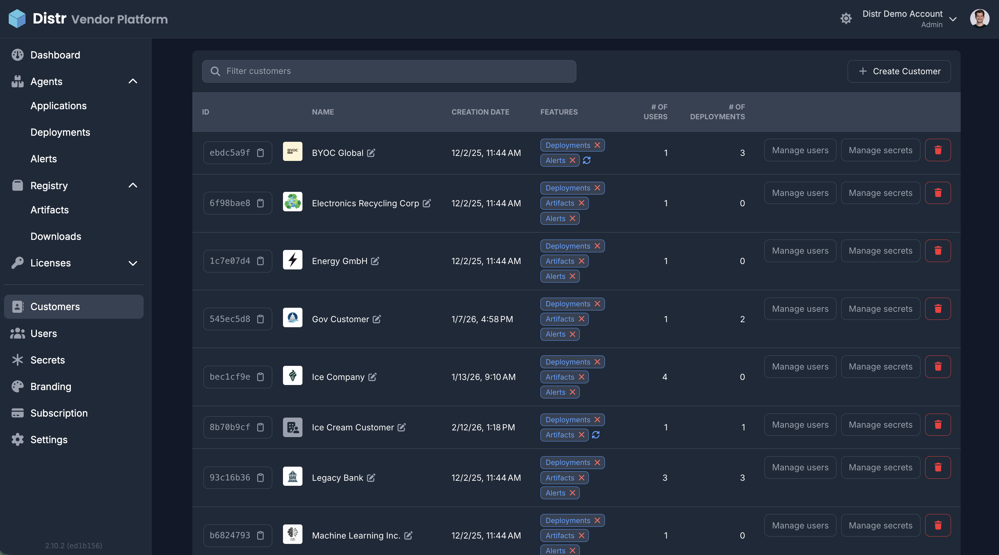

import {Aside} from '@astrojs/starlight/components';

The **Customers** section in the [Vendor Portal](/docs/product/vendor-portal/) is where you create and manage customer accounts, invite customer users, manage customer-specific secrets, and control which features each customer can use. This guide walks you through the customer management interface and common tasks.

## Overview

From the Customers page you can:

- **Create customers** and give them a name
- **Invite customer users** (name, email, and [role](/docs/product/rbac/)) and manage access per customer
- **Manage secrets** for a specific customer—see [Manage Secrets](/docs/guides/secrets/) for how secrets work
- **Enable or disable features** per customer: Deployments, [Alerts](/docs/product/alters/), and Artifacts

Use the **Filter customers** search bar to find customers, and **+ Create Customer** to add a new one.

## Creating a customer

1. In the Vendor Portal sidebar, go to **Customers**.
2. Click **+ Create Customer**.
3. Enter a name for the customer.
4. Confirm to create the customer.

The new customer appears in the list. You can then invite users, manage secrets, and configure features for them.

## Inviting customer users

1. In the **Customers** list, open the customer you want to add users to.
2. Click **Manage users** for that customer.
3. Click **Add user** (or **Invite User**).
4. Enter **name**, **email**, and **role** (see [RBAC](/docs/product/rbac/) for Administrator, User, and Viewer).
5. Submit the invitation.

The invited user receives an email to set up their account. The **first user** for a customer is always an **Administrator**. After that, customer admins can add or remove users themselves from the [Customer Portal](/docs/product/customer-portal/).

<Aside type="tip">
  The full steps and role options for inviting customer users are described in
  [Inviting Customer Organization
  Users](/docs/product/rbac/#inviting-customer-organization-users).
</Aside>

## Managing secrets per customer

For each customer you can manage secrets that are only available to that customer’s deployments:

1. In the **Customers** list, find the customer.
2. Click **Manage secrets** for that customer.

For how to create, edit, and use secrets (including customer-scoped secrets), see [Manage Secrets](/docs/guides/secrets/).

## Enabling and disabling features per customer

You can turn **Deployments**, **[Alerts](/docs/product/alters/)**, and **Artifacts** on or off per customer. For example, if a customer only uses artifacts, you can disable Alerts and Deployments for them.

- **Disable a feature:** Click the **red X** next to the feature in the **FEATURES** column for that customer.
- **[Alerts](/docs/product/alters/)** are **disabled by default** for new customers. To enable Alerts for a customer, click the **circled arrow icon** next to the features for that customer.
- **Re-enable a feature** you previously disabled: click the **circled arrow icon** next to the feature under that customer.

Changes take effect immediately for that customer.

---

Next steps: assign access with [Application Licenses](/docs/guides/application-licenses/) or [Artifact Licenses](/docs/guides/artifact-licenses/), or learn the [End-customer view of Distr](/docs/guides/container-registry-for-end-customers/).
