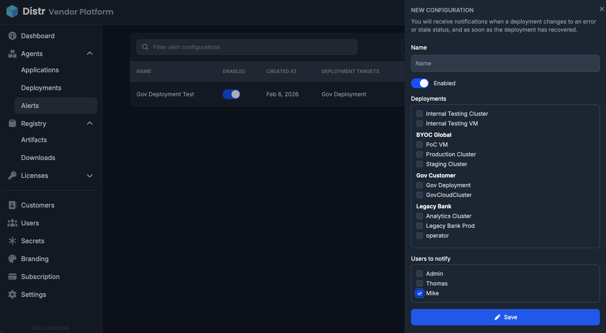

import {Aside} from '@astrojs/starlight/components';

Alerts allow [vendors](/glossary/isv-meaning/) to proactively monitor deployments and get notified when something goes wrong.

If a deployment runs into issues — for example due to failed updates, lost connectivity, crashes, or unhealthy state transitions — selected users receive an email notification. This ensures you are aware of problems early and can react before they escalate.

<Aside type="note">
  Alerts apply only to [agent-based deployments](/docs/product/agents/) and are
  not available for [registry-only usage](/docs/product/registry/). Alerts are a
  **Pro feature** and require a [Pro subscription.](/pricing)
</Aside>

## Vendor Alerts and Customer Alerts

By default, alerts are vendor-managed. [Vendors](/glossary/isv-meaning/) configure alerts for their deployments and decide who gets notified.

Under **Customers** in the [Vendor Portal](/docs/product/vendor-portal/), [vendors](/glossary/isv-meaning/) can choose whether a specific customer organization is allowed to create and manage their own alert configurations.

This supports two common scenarios:

**Vendor-managed deployments**

If you operate and manage deployments for your customers, you likely want to receive alerts yourself — potentially before the customer even notices an issue.

**Customer-managed deployments**

If customers operate their own deployments, they typically want to configure alerts themselves and control who in their organization gets notified.

This setting gives [vendors](/glossary/isv-meaning/) full control over which model applies per customer organization.

## How to Configure Alerts

In the left sidebar, navigate to **Agents**, then open **Alerts**.

To create an alert configuration:

1. Select **Create alert configuration**
2. Enter a name for the alert
3. Select one or multiple deployments to monitor
4. Select the users who should receive email notifications

You can also review the **notification history** to see previously triggered alerts.

If alert management is enabled for a customer organization (under **Customers**), users within that organization can use the same flow to configure alerts for their deployments.

## When Notifications Are Sent

An email notification is triggered when a monitored deployment transitions from a healthy state to a degraded state:

- **From:** Running or Healthy
- **To:** Stale or Error

For a full list of deployment statuses and their meaning, see [Deployment Health](/docs/product/agents/#deployment-health) in the Deployment Agents section. For details on how Running vs. Healthy is determined, see [Healthchecks](/docs/product/agents/#healthchecks).
